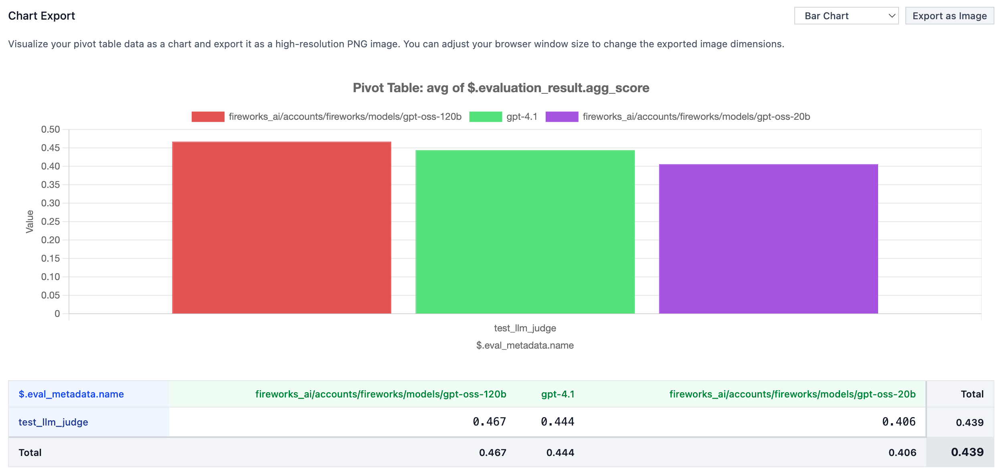

<h1 align="center">Arena-Hard-Auto Judge</h1>

<p align="center">
  
</p>

<p align="center">
    Build a data-driven model leaderboard from your existing LLM traces. No hand-written evals or ground truth required.
</p>

<p align="center">
  <a href="#features"><strong>Features</strong></a> ·
  <a href="#quick-start"><strong>Quick Start</strong></a> ·
  <a href="#running-the-example"><strong>Running the Example</strong></a> ·
  <a href="#how-it-works"><strong>How It Works</strong></a>
</p>

<br/>

## Features

- **No Ground Truth Required** - Evaluate models using pairwise comparisons on your existing conversation traces
- **Arena-Hard-Auto Methodology** - Battle-tested approach using LLM judges to compare model responses
- **Multiple Model Support** - Test GPT-4.1, Fireworks models, Gemini, and more in a single run
- **Statistical Confidence** - Win rates with confidence intervals, not gut feelings
- **Production-Ready** - Built on [Eval Protocol](https://github.com/eval-protocol/python-sdk) with support for Langfuse, Braintrust, and LangSmith
- **Interactive Results** - Local leaderboard UI for analyzing performance, cost, and latency metrics

## Quick Start

### Installation

```bash
pip install "eval-protocol[langfuse]"
```

### Environment Setup

Set up your API keys for the models and tracing platform you want to use:

```bash
# Model API keys (choose what you need)
export OPENAI_API_KEY="your_openai_key"
export FIREWORKS_API_KEY="your_fireworks_key"

# Langfuse keys
export LANGFUSE_PUBLIC_KEY="your_public_key"
export LANGFUSE_SECRET_KEY="your_secret_key"
export LANGFUSE_HOST="https://your-deployment.com"  # Optional
```

## Running the Example

This example evaluates multiple models against your Langfuse traces using pairwise comparisons:

```bash
python -m pytest quickstart.py -vs
```

### What's Happening

1. **Fetch traces** from your Langfuse instance
2. **Extract test cases** from multi-turn conversations (each assistant response becomes a test)
3. **Run three models** in parallel: GPT-4.1 and two Fireworks models
4. **Compare responses** using a Kimi-K2-0905-Instruct LLM judge (Arena-Hard-Auto methodology)
5. **Display results** with a link to your local leaderboard

See the full code in [`quickstart.py`](quickstart.py).

### Viewing Results

After running the test, start the local UI server:

```bash
ep logs
```

You'll see output like:

```
================================================================================
📊 LOCAL UI EVALUATION RESULTS
================================================================================
📊 Invocation messy-party-41:
  📊 Aggregate scores: http://localhost:8000/pivot?filterConfig=...
  📋 Trajectories: http://localhost:8000/table?filterConfig=...
================================================================================
```

Click the aggregate scores link to view your model leaderboard with:
- Win rates and confidence intervals
- Cost per evaluation
- Latency metrics
- Individual judgment details

<p align="center">
  
</p>

## How It Works

**Arena-Hard-Auto** is a pairwise comparison methodology where:

1. **Two models** respond to the same prompt from your traces
2. **An LLM judge** compares the responses in two rounds (A vs B, then B vs A) to reduce position bias
3. **Win rates** are calculated across many comparisons using bootstrap aggregation
4. **No ground truth needed** - just relative quality assessment

This approach has been validated against human preferences and correlates well with other benchmark methods.

## Learn More

- [Eval Protocol Documentation](https://evalprotocol.io/introduction)
- [Arena-Hard-Auto Paper](https://arxiv.org/abs/2406.11939)
- [LiteLLM Supported Models](https://docs.litellm.ai/docs/providers)